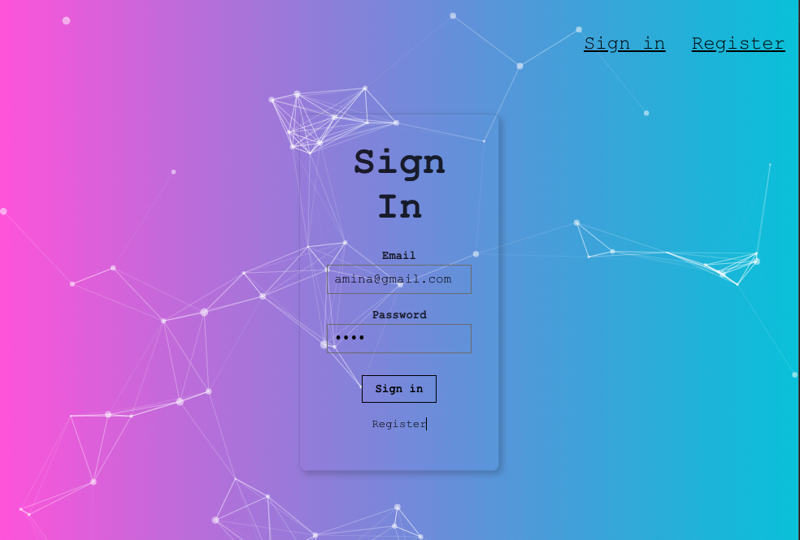
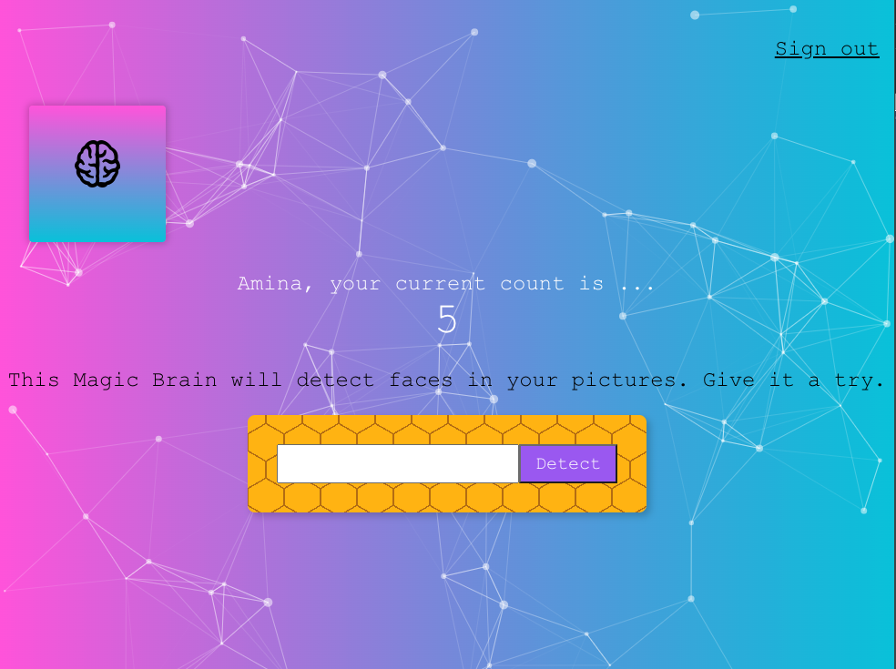
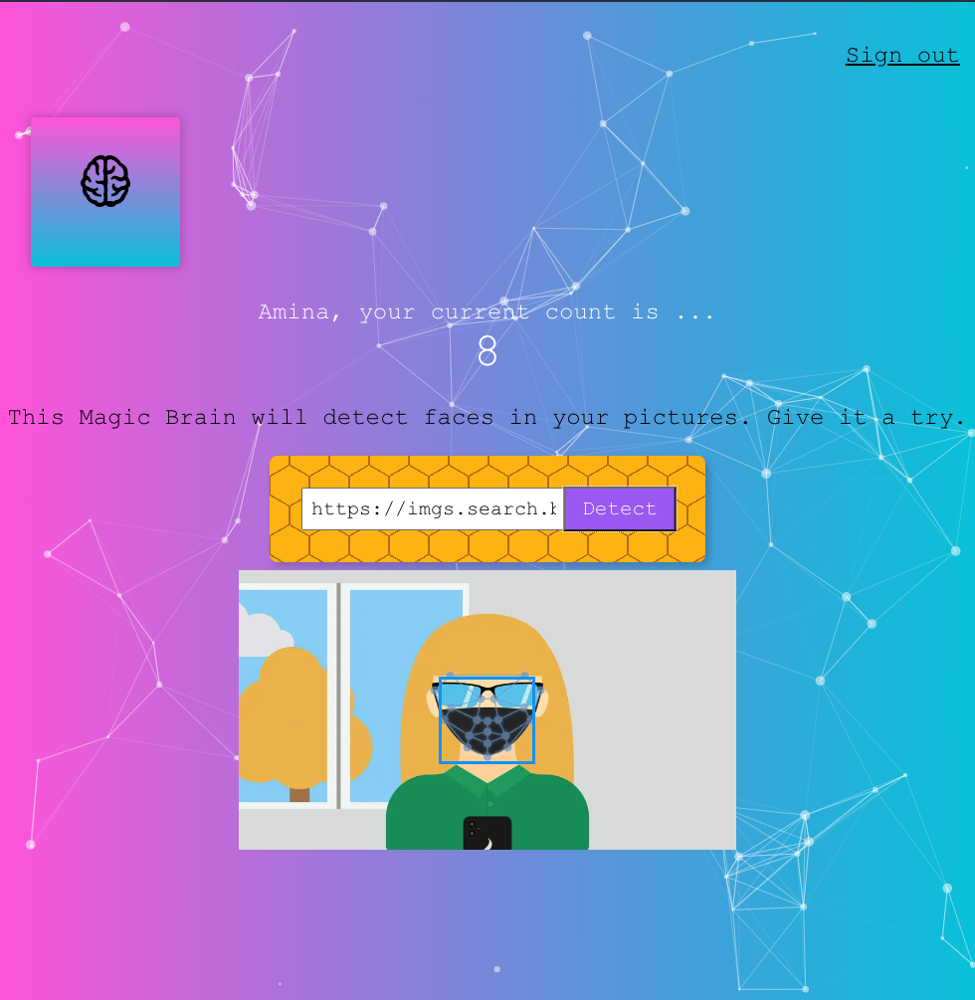
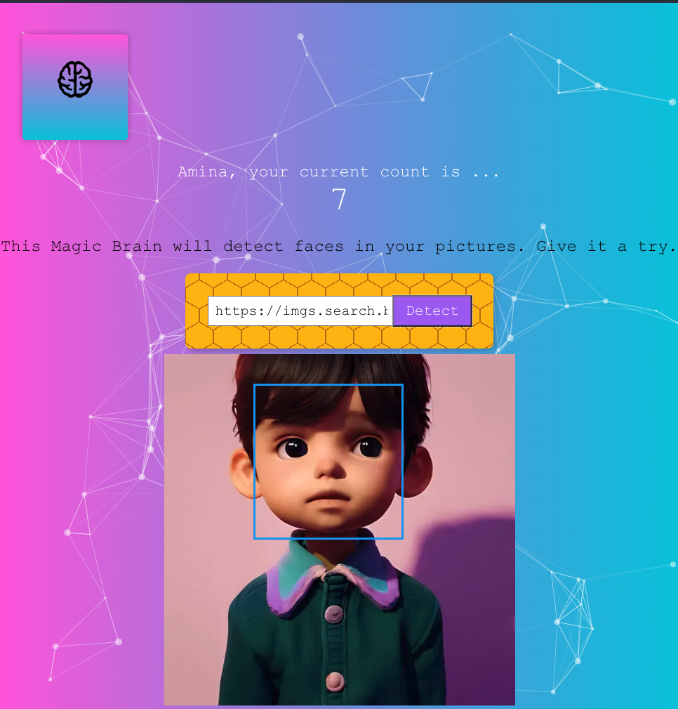
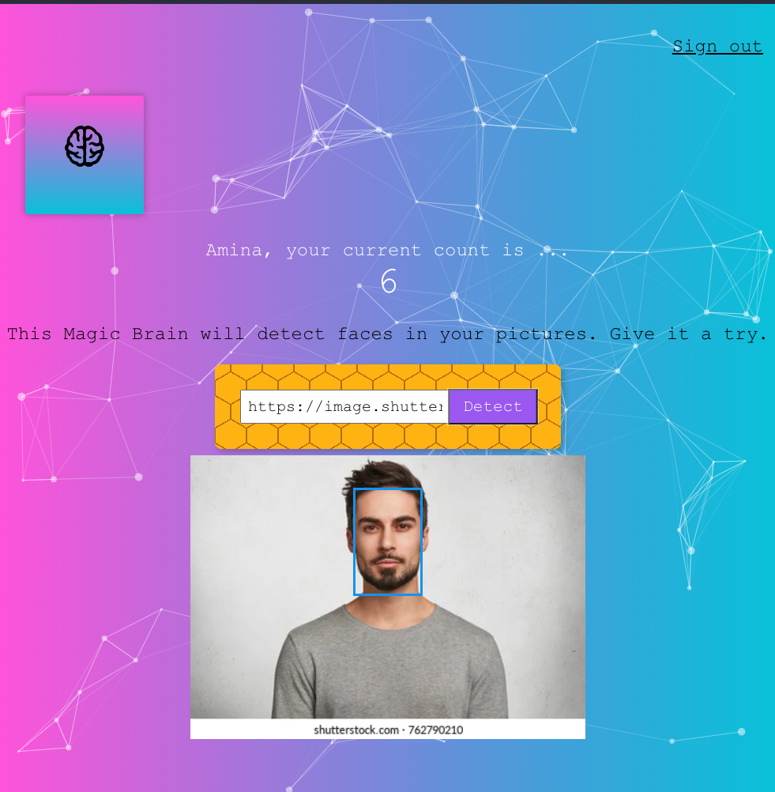

### Features
- Sign-in, Sign-up
- detect human face from images (https://image.shutterstock.com/image-photo/isolated-shot-young-handsome-male-260nw-762790210.jpg)
- use image links from the internet to detect human faces
- keeps a count on how many times you try face-detection
- used Clarifai Face Detection API for the project
- PostgreSQL as DB

### Frontend
https://github.com/Nisha1205092/facerecognitionbrain

### Clarifai Guide
https://docs.clarifai.com/clarifai-basics/start-here-5-mins-or-less

### Face Detection model being used:
https://www.clarifai.com/models/face-detection

The DB (on Render) will expire after 90 days (i.e., 19 Nov 2023)

